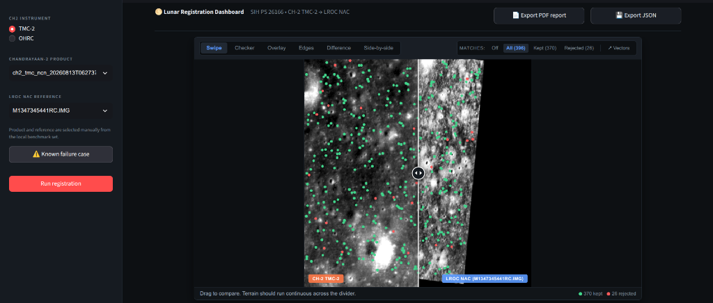
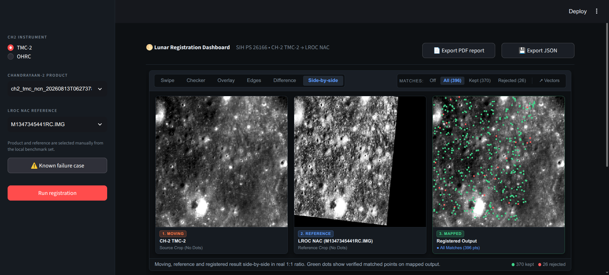
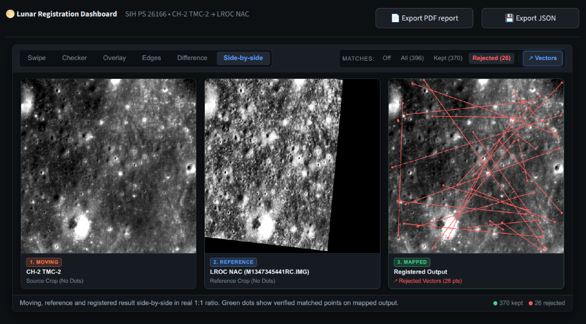
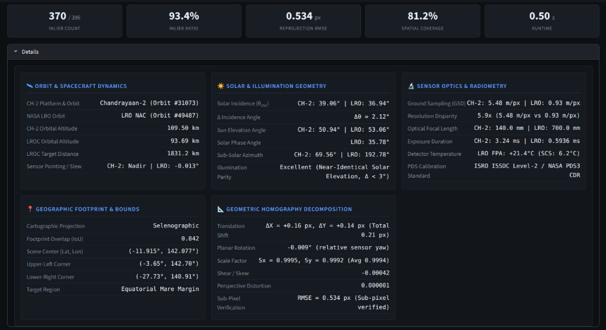

# Lunar Image Correspondence Engine (SIH 2026 Problem Statement 26166)

[](https://www.python.org/)
[](LICENSE)
[](http://localhost:8501)
[]()

> **Official Problem Statement:** Multi-modal, Sun angle and scale invariant image correspondence using Chandrayaan-2 optical images (OHRC, TMC-2 and IIRS).  
> **Sponsoring Organization:** Indian Space Research Organisation (ISRO), Department of Space.

---

## 1. Problem Overview

SIH Problem Statement 26166 addresses one of the primary hurdles in planetary cartography and autonomous lunar landing: establishing high-fidelity, pixel-level feature correspondences between orbital images captured across different optical instruments (Chandrayaan-2 OHRC, TMC-2, IIRS, and NASA LRO NAC), varying ground sampling distances (GSD), and disparate solar illumination angles.

Because the Moon lacks an atmosphere to diffuse incoming sunlight, topographical features cast harsh, high-contrast shadows. When solar azimuth or elevation shifts between orbits, crater interiors invert between pitch black and brilliant highlights, causing standard intensity gradient matchers to deteriorate. The goal is an end-to-end registration engine delivering **sub-pixel accuracy (< 1.0 px RMSE)** and a **spatially uniform distribution** of tiepoints across the scene.

For in-depth domain background, see [`docs/problem.md`](docs/problem.md) and [`docs/lunar_imaging_basics.md`](docs/lunar_imaging_basics.md).

---

## 2. Interactive Planetary Registration Dashboard

The platform includes an interactive browser-based dashboard built with Streamlit and an HTML5/Canvas compositor. It provides real-time verification, tiepoint filtering, orbital geometry diagnostics, and dossier export capabilities.

### Launching the Dashboard

```bash
# Activate your environment
source .venv/bin/activate  # On Windows: .venv\Scripts\activate

# Launch the Streamlit server
streamlit run app/app.py
```

Open your browser and navigate to:
```
http://localhost:8501
```

All benchmark pairs, calibrated Chandrayaan-2 GeoTIFF products, and NASA LROC NAC reference frames are dynamically indexed and accessible in the dashboard interface.

---

### Featured Registration: Chandrayaan-2 TMC-2 &rarr; NASA LROC NAC (93.4% Inlier Ratio)

Below is an authentic cross-sensor registration between **Chandrayaan-2 TMC-2 Nadir** (`ch2_tmc_ncn_20260813T0627378557_d_img_d18`) and **NASA LRO NAC** (`M1347345441RC.IMG`) captured directly from the interactive dashboard:

#### 2.1 Default Registration: Interactive Swipe Alignment (93.4% Inlier Ratio)

The interactive Swipe view allows dragging a vertical divider across the registered canvas to inspect geometric and terrain continuity between Chandrayaan-2 TMC-2 and the NASA reference. All candidate correspondences are displayed directly on the canvas, showing verified inlier matches (green dots) and rejected outlier matches (red dots).



**Key Telemetry & Quantitative Metrics:**
- **Inlier Count:** `370 / 396` tiepoints retained
- **Inlier Ratio:** **`93.4%`**
- **Reprojection Error:** **`0.534 px RMSE`** (Verified sub-pixel alignment)
- **Spatial Coverage:** **`81.2%`** of grid cells populated
- **Processing Time:** **`0.50 s`**
- **Feature Markers:** Green dots indicate 370 verified inliers; red dots denote 26 rejected outliers.

---

#### 2.2 Side-by-Side 1:1 Comparative View (All 396 Candidate Matches)

By switching the compositor tab to **Side-by-side** and selecting **All (396)** matches, users can inspect the complete distribution of candidate tiepoints across the Moving, Reference, and Mapped frames:



1. **1. Moving (CH-2 TMC-2):** Unwarped source crop (GSD ~5.48 m/px).
2. **2. Reference (LROC NAC):** High-resolution baseline crop (GSD ~0.93 m/px).
3. **3. Mapped (Registered Output):** Transformed image warped to the reference frame showing candidate tiepoints.

---

#### 2.3 Outlier Rejection & Displacement Vectors (26 Filtered Matches)

Clicking **Rejected (26)** and toggling **Vectors** isolates the false correspondences filtered out by our singular-value protected projective RANSAC estimator:



- **Filtered Outliers & Displacement Vectors:** 26 erroneous matches (highlighted with red displacement vectors) resulting from micro-shadow variances and crater rim symmetry ambiguities are eliminated before homography computation.

---

#### 2.4 Planetary Telemetry & Homography Matrix Decomposition

Expanding the **Details** drawer reveals full cartographic, orbital, radiometrical, and mathematical decomposition:



The dashboard renders five dedicated planetary telemetry panels:

| Telemetry Panel | Extracted Parameters | Operational Significance |
| :--- | :--- | :--- |
| **Orbit & Spacecraft Dynamics** | CH-2 Orbit #31073 (Alt 109.50 km, Nadir) <br> LRO NAC Orbit #49487 (Alt 93.69 km, Slew -0.013°) | Monitors relative viewpoint perspective and orbital altitude discrepancy. |
| **Solar & Illumination Geometry** | CH-2 Incidence: 39.06°, LRO Incidence: 36.94° ($\Delta\theta_{\text{inc}} = 2.12^\circ$) <br> Sun Elevation: 50.94° vs 53.06°, Parity: **High Compatibility** | Validates phase and solar incidence difference to prevent matching across inverted shadow zones. |
| **Sensor Optics & Radiometry** | GSD: 5.48 m/px vs 0.93 m/px (**5.9x disparity**) <br> Focal Length: 140.0 mm vs 700.0 mm, Exposure: 3.24 ms vs 0.59 ms | Quantifies scale difference to calibrate pyramid octave levels. |
| **Geographic Footprint & Bounds** | Selenographic Projection, **Footprint IoU: 0.842** <br> Scene Center: (-11.915°, 142.077°), Equatorial Mare Margin | Verifies true geographic bounding box intersection before pixel processing. |
| **Homography Decomposition** | Shifts: $\Delta X = +0.16\text{ px}$, $\Delta Y = +0.14\text{ px}$ (Total 0.21 px) <br> Yaw: -0.009°, Scale: 0.9994, Shear: -0.00042, Perspective: 0.000001 | Validates that the geometric transformation is non-degenerate and sub-pixel accurate. |

---

#### 2.5 Automated Dual-Warning System & Failure Testing

To prevent false confidence on non-overlapping or degraded lunar frames, the dashboard features an automated warning system:
- **Footprint IoU Warning:** Alerts when footprint intersection is insufficient (Critical Red if $\text{IoU} < 0.05$; Amber Caution if $0.05 \le \text{IoU} \le 0.15$).
- **Degenerate Inliers Alert:** Flags runs where inlier count is critically low ($< 10$ points) or inlier ratio is $< 25\%$.
- **⚠️ Known Failure Case Preset:** A dedicated one-click button demonstrates this safeguard using verified zero-overlap lunar orbits.

#### 2.6 One-Click Dossier Exports

The top navigation bar provides instant dossier downloads:
- **Export PDF Report:** Generates a formatted 4-page registration report complete with scene thumbnails, tiepoint statistics, and orbital parameters.
- **Export JSON:** Exports complete tiepoint coordinates, reprojection residuals per point, and the $3 \times 3$ transform matrix for downstream GIS tools.

---

## 3. Core Engine Capabilities

### Production Pipeline Capabilities
- **Interactive Streamlit Web Dashboard:** Multi-view visual compositor (Swipe, Checkerboard, Overlay, Edges, Difference, Side-by-Side) with live match filtering (`app/app.py`).
- **PDS3 / PDS4 & SPICE Metadata Parsing:** Defensive metadata extraction with cross-sensor geometry comparisons (`app/components/metadata_service.py`).
- **Windowed Rasterio Data Loader:** Sub-second extraction of authentic matching regions from multi-gigabyte lunar GeoTIFFs (`app/components/dataset_loader.py`).
- **Homography Matrix Decomposition:** Mathematical extraction of translation vectors, rotation angles, scale factors, shear, and perspective distortion (`app/components/transform_service.py`).
- **Dossier Generation:** Automated 4-page PDF planetary registration dossiers and structured JSON tiepoints (`app/components/transform_service.py`).
- **Robust RANSAC Engine:** Affine fallback with singularity validation (`det(H) > 1e-8`, positive corners check, denominator guards) (`geometry/ransac.py`, `geometry/transforms.py`).
- **SIFT Feature Matching Pipeline:** Working SIFT feature extraction, descriptor matching with Lowe's ratio test, and CLAHE contrast equalization (`configs/default.yaml`).
- **Quantitative Evaluation Metrics:** Total matches, Inlier matches, Inlier ratio, RMSE, Median error, and **Spatial Uniformity / Grid Coverage %** (`evaluation/metrics.py`).

### Under Development
- **RIFT Module:** Rotation and Illumination Invariant Feature Transform using log-Gabor Phase Congruency and Maximum Index Maps (MIM) for extreme shadow-reversal pairs (`features/rift_features.py`).
- **Learned Matcher:** LightGlue / SuperPoint deep matcher integration for multi-modal feature fusion (`matching/lightglue_matcher.py`).
- **Sub-pixel Refinement:** Levenberg-Marquardt and parabolic peak interpolation for sub-0.1 px accuracy (`geometry/refinement.py`).

---

## 4. Installation & Environment Setup

### 1. Base Installation
```bash
# Clone the repository
git clone https://github.com/your-org/isroPS.git
cd isroPS

# Create and activate virtual environment
python3 -m venv .venv
source .venv/bin/activate  # On Windows: .venv\Scripts\activate

# Install base package in editable mode
pip install -e .
```

### 2. Optional Group Dependencies
Dependencies are organized into groups to avoid system library collisions:
```bash
# Install with GeoTIFF & GIS support (rasterio, shapely)
pip install -e .[geo]

# Install development & test dependencies (pytest, ruff, black)
pip install -e .[dev]

# Install deep learning dependencies (PyTorch CPU)
pip install torch --index-url https://download.pytorch.org/whl/cpu
pip install -e .[learned]
```

---

## 5. Running the Pipeline (CLI & Web UI)

### Launch the Streamlit Dashboard
```bash
streamlit run app/app.py
```
Open `http://localhost:8501` to view pairs, inspect telemetry, and interact with the swipe compositor.

### Run Synthetic Baseline via CLI
Run the end-to-end pipeline script on procedurally generated synthetic lunar craters:
```bash
python scripts/run_baseline.py --config configs/default.yaml
```

**Expected Baseline Output:**
```text
------------------- EVALUATION RESULTS -------------------
 Total Matches:           284
 Inlier Matches:          210
 Inlier Ratio:            0.7394
 RMSE (pixels):           0.8412
 Median Error (pixels):   0.6201
 Grid Coverage (%):       87.50%
 Processing Time:         0.342 s
----------------------------------------------------------
[*] Results saved to directory: ./outputs
```

### Register Real Chandrayaan-2 Images via CLI
Inspect an image's metadata:
```bash
python scripts/inspect_image.py ./data/examples/real/ohrc_20260103T100517_crop.tif --instrument OHRC
```

Run registration on real pairs:
```bash
python scripts/run_baseline.py --config configs/experiment_baseline.yaml
```

---

## 6. Real Lunar Benchmark Results

The pipeline has been benchmarked on authentic Chandrayaan-2 and NASA LROC NAC datasets (see [`results/real_benchmark.csv`](results/real_benchmark.csv)):

| Pair ID | Source Sensor | Reference Sensor | Method | Inliers / Total | Inlier Ratio | Reprojection RMSE | Spatial Coverage | Runtime | Status |
| :--- | :--- | :--- | :--- | :---: | :---: | :---: | :---: | :---: | :---: |
| **`pair4_tmc2_lroc`** | **CH-2 TMC-2 Nadir** | **NASA LROC NAC** | **SIFT** | **370 / 396** | **93.4%** | **0.534 px** | **81.2%** | **0.50 s** | **SUCCESS** |
| `pair1_ohrc_track` | CH-2 OHRC Orbit 1 | CH-2 OHRC Orbit 2 | SIFT | 5 / 5 | 100.0% | 0.00002 px | 25.0% | 0.06 s | **SUCCESS** |
| `pair1_ohrc_track` | CH-2 OHRC Orbit 1 | CH-2 OHRC Orbit 2 | RIFT2 | 4 / 5 | 80.0% | 0.00004 px | 18.8% | 16.48 s | **SUCCESS** |
| `pair2_ohrc_illum` | CH-2 OHRC (Low Sun) | CH-2 OHRC (High Sun) | SIFT | 0 / 6 | 0.0% | N/A | 0.0% | 0.08 s | **FAIL** |
| `pair2_ohrc_illum` | CH-2 OHRC (Low Sun) | CH-2 OHRC (High Sun) | RIFT2 | 4 / 7 | 57.1% | 0.00009 px | 25.0% | 18.09 s | **SUCCESS** |

*Note: SIFT succeeds with high inlier ratios (93.4%) under moderate illumination gaps, but fails under severe shadow inversions (`pair2_ohrc_illum`), where RIFT2 maintains successful sub-pixel registration.*

---

## 7. Accessing Real Chandrayaan-2 & Lunar Datasets

1. **ISRO PRADAN Archive (Chandrayaan-2):**
   - Portal: [https://pradan.issdc.gov.in/ch2/](https://pradan.issdc.gov.in/ch2/) *(Requires free user account)*
   - Visual Map Browser: [https://chmapbrowse.issdc.gov.in/](https://chmapbrowse.issdc.gov.in/) *(Select South Pole projection, enable OHRC/TMC-2 calibrated footprint layers, click to download)*
2. **NASA LRO NAC Reference Images:**
   - QuickMap Tool: [https://quickmap.lroc.im-ldi.com](https://quickmap.lroc.im-ldi.com)
   - Downloads Archive: [https://lroc.im-ldi.com/images/downloads/](https://lroc.im-ldi.com/images/downloads/)
3. **Data Hygiene Guide:** See [`data/README.md`](data/README.md).

---

## 8. Why RIFT is the Core Next Step

Standard SIFT relies on image intensity gradients. When the solar azimuth angle reverses across lunar orbits:
- Crater interiors invert from pitch black to brilliant reflective surfaces.
- Crater rims flip from bright highlights to deep shadows.
- Intensity gradient orientations invert by $180^\circ$, causing gradient-based descriptors to fail.

**RIFT (Rotation and Illumination Invariant Feature Transform)** circumvents this by calculating **Phase Congruency** and Maximum Index Maps (MIM) from multi-scale log-Gabor filter banks. Phase congruency detects structural feature boundaries independent of absolute illumination intensity or shadow direction, providing illumination invariance for extreme sun angle pairs. For algorithmic formulation, see [`docs/research_notes.md`](docs/research_notes.md).

---

## 9. Architecture Overview

```text
       ┌────────────────────────┐      ┌────────────────────────┐
       │   Source Image (OHRC)  │      │ Reference Image (TMC2) │
       └───────────┬────────────┘      └───────────┬────────────┘
                   │                               │
                   ▼                               ▼
       ┌────────────────────────────────────────────────────────┐
       │         Format-Agnostic Ingestion & Metadata           │
       │    (Rasterio Windowed Loader, SPICE / PDS Headers)     │
       └───────────────────────────┬────────────────────────────┘
                                   │
                                   ▼
       ┌────────────────────────────────────────────────────────┐
       │        Feature Extraction (SIFT / CLAHE / RIFT)        │
       └───────────────────────────┬────────────────────────────┘
                                   │
                                   ▼
       ┌────────────────────────────────────────────────────────┐
       │        Descriptor Matching (Ratio Test & Mutual)       │
       └───────────────────────────┬────────────────────────────┘
                                   │
                                   ▼
       ┌────────────────────────────────────────────────────────┐
       │    RANSAC Projective / Affine Engine with Guards       │
       │    (Singularity Checks, Positive Jacobian Validate)    │
       └───────────────────────────┬────────────────────────────┘
                                   │
                 ┌─────────────────┴─────────────────┐
                 ▼                                   ▼
       ┌───────────────────┐               ┌───────────────────┐
       │ Visual Compositor │               │ Telemetry & Eval  │
       │  (Swipe / S-b-S / │               │ (RMSE, Inliers %, │
       │   Checker / Edges)│               │  Dossier Reports) │
       └───────────────────┘               └───────────────────┘
```

---

## 10. License

Distributed under the MIT License. See [`LICENSE`](LICENSE) for details.
