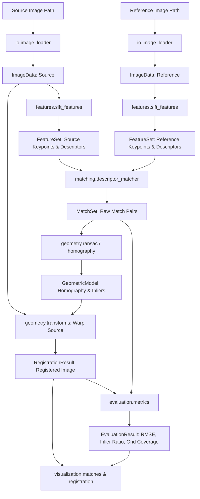

# System Architecture: Lunar Image Correspondence Engine

## Critical Coordinate Convention Standard
> **CRITICAL CONVENTION:** All 2D point coordinates throughout this codebase (`FeatureSet.keypoints`, `MatchSet.source_points`, `GeometricModel.transform_matrix`, etc.) strictly enforce the **`(x, y) = (column, row)`** coordinate convention, matching OpenCV. `x` ranges from `0` to `width - 1`, and `y` ranges from `0` to `height - 1`. Array indexing follows NumPy `array[row, col] = array[y, x]`.

---

## Architectural Principles

1. **Format-Agnostic Ingestion:** Input loaders convert PNG, JPEG, TIFF, GeoTIFF, or PDS4 formats into a unified `ImageData` dataclass containing `(H, W, C)` array data and explicit `ImageMetadata`.
2. **Channel Independence:** `ImageData.array` is shape `(H, W, C)` with `C >= 1`. Feature extractors explicitly select or reduce channels rather than assuming grayscale or RGB inputs.
3. **Pluggable Abstrations:** Key components (`FeatureExtractor`, `Matcher`) inherit from explicit Abstract Base Classes (ABCs) with signature `**kwargs` support to maintain interface stability as new algorithms (RIFT, LightGlue) are added.
4. **Reproducible Execution:** Every pipeline run accepts a explicit `random_seed` that seeds NumPy, OpenCV, and Python random number generators.

---

## High-Level Data Flow

---

## Directory Organization & Responsibilities

- `src/lunar_correspondence/config.py`: Configuration loading with deep-merging (`cpu.yaml` / `experiment.yaml` over `default.yaml`).
- `src/lunar_correspondence/pipeline.py`: Main orchestration class `RegistrationPipeline` coordinating ingestion, feature extraction, matching, RANSAC, warping, and evaluation.
- `src/lunar_correspondence/io/`: Robust file loaders, metadata handlers, and format-specific adaptors (PNG/TIFF real; PDS4/GeoTIFF stubs).
- `src/lunar_correspondence/preprocessing/`: Image normalization, CLAHE enhancement, Gaussian pyramid generation, and grid tiling.
- `src/lunar_correspondence/features/`: Feature extraction implementations (`FeatureExtractor` ABC, SIFT baseline, RIFT/LightGlue stubs).
- `src/lunar_correspondence/matching/`: Descriptor and feature matching implementations (`Matcher` ABC, Brute-Force/FLANN matcher, stubs).
- `src/lunar_correspondence/geometry/`: Matrix estimation (Homography/Affine), RANSAC robust estimation, warping transforms, subpixel refinement.
- `src/lunar_correspondence/planetary/`: Instrument metadata registry (OHRC, TMC-2, IIRS, LRO_NAC, SELENE), coordinate transformations, SPICE stubs.
- `src/lunar_correspondence/evaluation/`: Quantitative metrics computation (inlier ratio, RMSE, grid-cell spatial coverage %).
- `src/lunar_correspondence/visualization/`: Matplotlib/OpenCV plotting utilities for side-by-side match lines, warped overlays, and error heatmaps.
